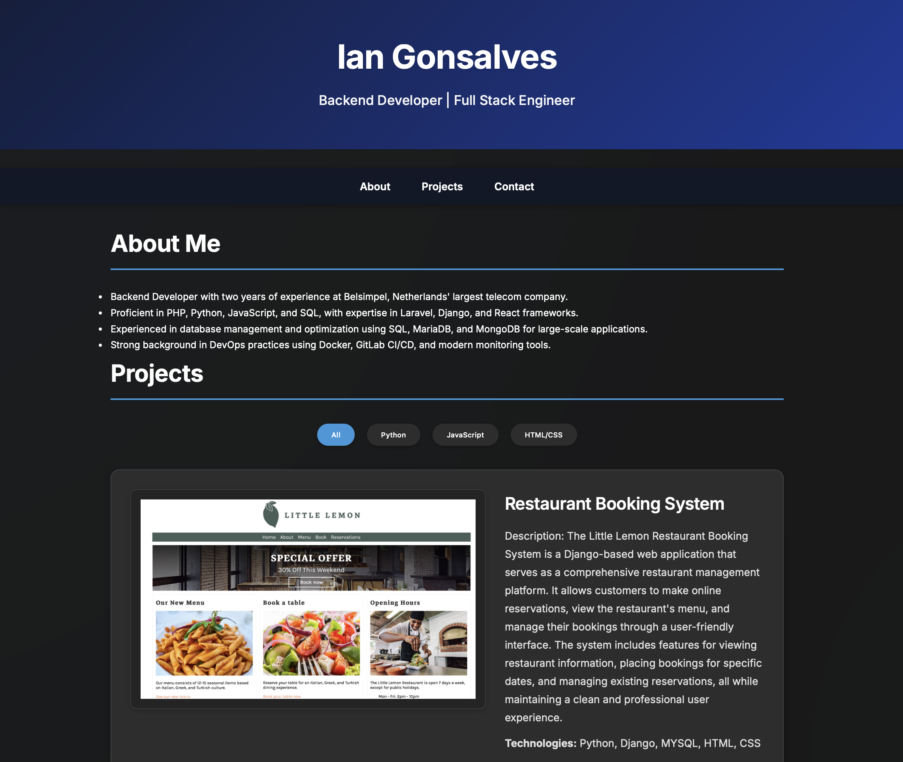

# Personal Portfolio Website

A responsive personal portfolio website showcasing my skills, projects, and professional experience as a Backend/Full Stack Developer.

## Features

- **About Section**: Professional overview highlighting experience at Belsimpel and technical expertise
- **Projects Section**: 
  - Interactive project filtering by technology (Python, JavaScript, HTML/CSS)
  - Featured projects with descriptions, technologies used, and live demos
  - Animated content transitions using AOS library
- **Contact Section**: Professional contact information and social links
- **Responsive Design**: Mobile-friendly layout using modern CSS

## Technologies

- HTML5
- CSS3
- JavaScript

## Projects Featured

- Restaurant Booking System (Django)
- Calculator (JavaScript)
- Etch-a-Sketch (JavaScript)
- Rock Paper Scissors Game (JavaScript)

## Live Demo

Visit the live portfolio at: [[iangonsalves.github.io/portfolio](https://iangonsalves.github.io/portfolio/)]

## Contact

- Email: iangonsalves29@gmail.com
- LinkedIn: [Ian Gonsalves](www.linkedin.com/in/iangonsalves)
- GitHub: [@iangonsalves](https://github.com/iangonsalves)